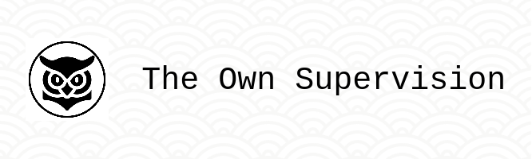

# OwnSupervision

O OwnSupervision é um bot moderador criado para auxiliar na gestão e na manutenção de comunidades no Reddit. Ele é projetado para automatizar tarefas de supervisão e garantir a conformidade com as diretrizes da comunidade.
Funcionalidades Principais:

    Supervisão de Links: Detecta e modera automaticamente links compartilhados pelos usuários.
    Notificações: Informa os moderadores sobre atividades suspeitas ou contra as regras.
    Configurações Personalizáveis: Adapta-se às necessidades específicas de cada subreddit com opções de configuração flexíveis.

Tecnologias Utilizadas:

    Python: Linguagem de programação principal.
    PRAW (Python Reddit API Wrapper): Biblioteca para interação com a API do Reddit.
    OAuth: Autenticação segura para acesso à API do Reddit.

Instalação e Uso:

Para usar o OwnSupervision, siga estas etapas:

    Clone o repositório do GitHub.
    Configure suas credenciais de OAuth no Reddit.
    Execute o bot em um ambiente compatível.

Contribuições são sempre bem vindas!
